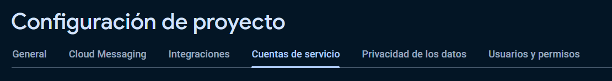

# Event Scheduler (REST API)

Una REST API hecha para una aplicación de programador de eventos.

## Technologies

### Core

- [Java 17](https://www.oracle.com/pe/java/technologies/downloads/#java17)
- [Spring Boot 3](https://spring.io)

### Dependencies

- [Spring Security - JWT](https://spring.io/projects/spring-security)
- [Spring Boot JPA](https://spring.io/projects/spring-data-jpa)
- [Spring Boot Mail](https://www.baeldung.com/spring-email)
- [Spring Boot Validation](https://www.baeldung.com/spring-boot-bean-validation)
- [Mapstruct](https://mapstruct.org)
- [Azure SDK Java](https://azure.github.io/azure-sdk/releases/latest/java.html)
- [Firebase SDK Java](https://mvnrepository.com/artifact/com.google.firebase/firebase-admin) - Cloud Messaging & Storage
- [Quartz](https://www.quartz-scheduler.org/)

### Test dependencies

- [Spring Boot Test](https://www.baeldung.com/spring-boot-testing)
- [H2 Database](https://www.baeldung.com/spring-boot-h2-database)
- [Mockito](https://site.mockito.org)
- [Faker](https://github.com/DiUS/java-faker)

### COMO EJECUTAR LA API

1. Debe de ir al paquete llamado `src/main/resources` y ahi debe de crear un archivo llamado `application-dev.yml`

2. Copie y pegue todo lo que hay en el archivo `application-dev-example.yml` dentro del archivo `application-dev.yml`

El archivo `application-dev.yml` debería verse asi:

```yml
spring:
    datasource:
        password:
        url:
        username:
    jpa:
        properties:
            hibernate:
                dialect: org.hibernate.dialect.MySQLDialect
        hibernate:
            ddl-auto: create-drop
        database: mysql
    quartz:
        job-store-type: jdbc
        jdbc:
            initialize-schema: always
        jobStore:
            class: org.quartz.impl.jdbcjobstore.JobStoreTX
            driveDelegateClass: org.quartz.impl.jdbcjobstore.StdJDBCDelegate
            dataSource: myDS
            tablePrefix: QRTZ_
        threadPool:
            threadCount: 5
    mail:
        host:
        port:
        username:
        password:
        smtp:
            auth: true
            starttls:
                enable: true

application:
    security:
        jwt:
            secret-key:
            expiration: 86400000 # 1 day in milliseconds
            refresh-token:
                expiration: 604800000 # 1 week in milliseconds

firebase:
    enabled: true
    cloud-storage:
        bucket-name:

logging:
    level:
        org:
            springframework:
                jdbc: DEBUG
```

3. Como es obvio debe tener conocimientos en Spring Boot para saber como configurar el tema de la base de datos y otras pero en este caso solo nos centraremos en 2 que son los siguientes:

1.
```yml
application:
    security:
        jwt:
            secret-key: // aquí
```

2.
```yml
firebase:
    enabled: true
    cloud-storage:
        bucket-name: // aquí
```

3.
```yml
    mail:
        host:
        port:
        username:
        password:
        smtp:
            auth: true
            starttls:
                enable: true
```

4. Para el primero es sencillo, solo necesita poner una cadena de caracteres aleatoria que sea medianamente larga y que solo tenga números y letras, nada de caracteres especiales.

5. Ahora para el siguiente punto require crear un proyecto de firebase, para ello ingrese a este [link](https://firebase.google.com/?hl=es) y cree el proyecto (Si previamente usted ya ha creado un proyecto de firebase no hay la necesidad de crear otro)

6. Luego de crear el proyecto ingrese a esta pestaña


7. Al ingresar habrá una opción para iniciar o crear un bucket (Yo elegí uno de tipo producción para asegurar que funcione), cuando se haya creado el bucket le tendrá que salir esta ventana


8. Ingrese a la pestaña llamada **_RULES_** y desde ahi modifique lo que tiene ahi para que sea igual a esto (OJO: No soy experto en Firebase yo solo busque una alternativa rápida para que funcione, ha decir verdad yo estoy 100% seguro que esta no es la mejor manera de configurar esto, pero como digo esto es solo para un proyecto académico y no uno real):


9. Luego necesita ir a la pagina de "Configuración de proyecto"


10. Ingrese a esta pestaña



11. Selecciona la opción __JAVA__ y dele a "Generar nueva clave privada"

12. Obtendremos un archivo de tipo JSON y este archivo le cambiaremos de nombre a "firebase-account.json", para luego moverlo dentro de nuestro proyecto al paquete llamado `src/main/resources`

13. Y para finalizar con la configuración de Firebase falta rellenar el valor llamado `bucket-name` y para ello vaya a la pagina "Storage" y saldrá esta pagina


14. Solo debe de copiar toda la linea que esta a la izquierda - arriba de la imagen (osea la parte que esta marcada con blanco, que en su caso si lo vería, solo que por temas de seguridad yo lo oculto)

15. Luego de copiarla solo debe de pegarlo aquí y listo:

```yml
firebase:
    enabled: true
    cloud-storage:
        bucket-name: // aquí va lo copiado (OJO: esto es en el archivo application-dev.yml)
```

16. Por ultimo faltaría esta parte:

```yml
    mail:
        host:
        port:
        username:
        password:
        smtp:
            auth: true
            starttls:
                enable: true
```

Para ser sincero aquí hay varias opciones, desde un GMAIL a utilizar SMTP de pruebas como [MAILTRAP](https://mailtrap.io/), pero en este caso utilizaremos vuestro GMAIL, para ello quiero que ponga lo siguiente:

```yml
    mail:
        host: smtp.gmail.com
        port: 587
        username: // aquí va su correo de gmail
        password: // aquí va su password de gmail
        smtp:
            auth: true
            starttls:
                enable: true
```

17. Con todo lo anterior realizado ahora si solo queda ejecutar el Spring Boot y ya estaría terminado
